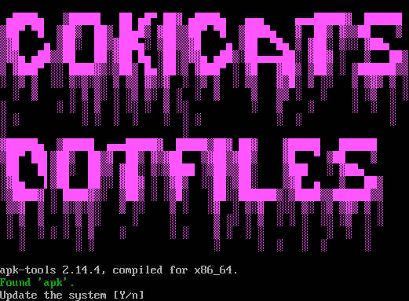

# Easily setup Alpine Linux
This script prepares Alpine to be ready for use after installation.  
It automatically installs a lightweight desktop, some useful utilities and my dotfiles to Alpine.  
The script will ask for update and then install the cool stuff.

# Installation
First, uncomment the second line of `/etc/apk/repositories`, e. g.:
```
http://dl-cdn.alpinelinux.org/alpine/edge/main
#http://dl-cdn.alpinelinux.org/alpine/edge/communinity
```
Will be:
```
http://dl-cdn.alpinelinux.org/alpine/edge/main
http://dl-cdn.alpinelinux.org/alpine/edge/communinity
```
This will enable the community repository.  
Next, as root, install `python3` which is required by `install` file.
```
apk add python3
``` 
And finally run as root:
```
./install
```

# Packages used
## Fonts
- `font-ubuntu`
- `font-liberation`
- `font-liberation-mono-nerd`

## X11
- Complete xorg server with `setup-xorg-base`
- `xf86-input-evdev`
- `xf86-input-synaptics`
- `jwm`
- `feh`
- `setxkbmap`
- `xrandr`

## Shell
- `bash`
- `bash-completion`

## Tools
- `neofetch`
- `sudo`
- `htop`
- `curl`
- `python3`
- `zip`
- `unzip`
- `7zip`
- `git`
- `github-cli`

## Editors
- `vim`
- `micro`
- `nano`

## Compilers
- `gcc`
- `make`
- `automake`
- `autoconf`

## Desktop applications
- `alacritty`
- `firefox`
- `rofi`
- `thunar`
- `file-roller`
- `network-manager-applet`

## [Qogir-theme](https://github.com/vinceliuice/Qogir-theme) & [Qogir-icon-theme](https://github.com/vinceliuice/Qogir-icon-theme)
- `gtk-murrine-engine`
- `gtk-engines`
- `sassc`


